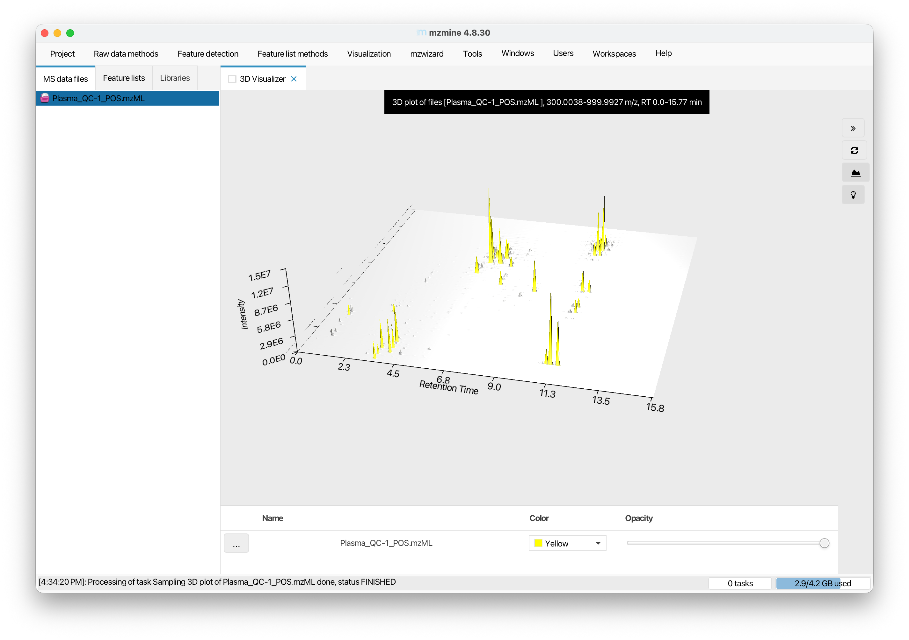
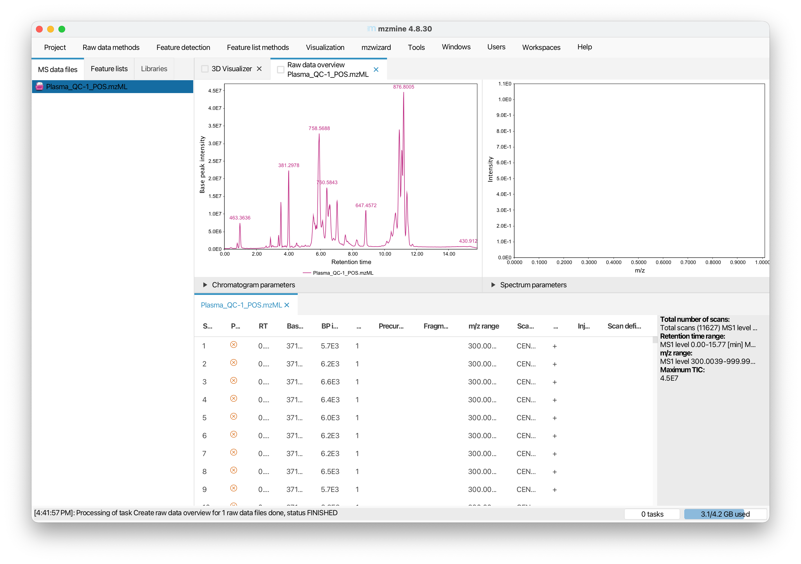
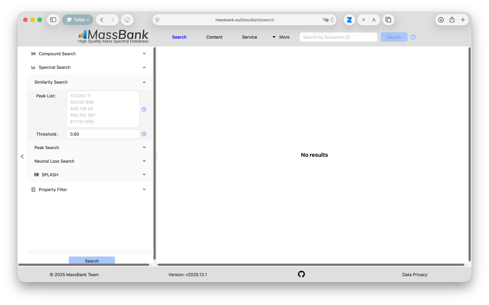

# 1. Introduction

In this project, you will go through some key aspects of the data processing workflow in lipidomics/metabolomics analysis. This project consists of two parts: (i) Exploration, feature extraction, and annotation from raw MS files of an untargeted lipidomics analysis of pooled human plasma samples. (ii) Post-processing and quality control of a larger targeted plasma lipidomics dataset starting from raw feature intensities.

Work through the step-by-step instructions below to be able to answer the project questions. Please feel free to contact me anytime if you have questions or issues running the software and code.

# 2. Installation of required software

## mzmine

*mzmine* is a popular open-source, platform-independent tools for the visualization, exploration and processing of mass spectrometry (MS) data, with focus on untargeted metabolomics and lipidomics.

The free community version of mzmine for macOS, Windows 11 and Linux is available from Github (<https://github.com/mzmine/mzmine/releases/tag/v4.9.14>).

Please register a user account using your university email address (via Menu "Users" → "Sign up" in the running application). **Note**: the confirmation email is typically first blocked by NUS. Once you receive a NoSpamMail email from NUS, approve sender. You may need to request for a new confirmation email to be able to have a valid activation link.

## R and Positron

For the postprocessing of metabolomics/lipidomics data there are different options. For this project, we will be using "mrmhub" a dedicated R library developed by our lab to explore some aspects of data postprocessing and QC. In order to use this library, the R software and a corresponding user interface, such as Positron or RStudio need to be installed:

1.  R (Version 4.1 or higher) : Download from [https://cloud.r-project.org](https://cloud.r-project.org/){.uri}
2.  Positron: download from <https://positron.posit.co/install.html>

If you prefer using RStudio ([https://posit.co/download/rstudio-desktop](https://posit.co/download/rstudio-desktop/){.uri}), all the code will also work.

# 3. Data preprocessing of untargeted lipidomics raw data

Start mzmine (see Section 1) and import the raw data file "Plasma_QC-1_POS.mzML" by drag and drop to the tab "MS Data Files". Right-click on the file name and select "Show 3D plot", click on "Auto Range", and then "OK"

{fig-align="center" width="614"}

::: {.callout-note appearance="simple"}
## Tasks 1 a/b

**(a)** Describe the plot, i.e. what do the individual axes represent, what do peaks and groups of peaks indicate?

**(b)** Looking at the peaks with long retention time, what kind of lipids may be represented by these peaks, assuming reversed-phase chromatography was used and considering their masses?
:::

Now double-click on the raw data file name, this should open a view with a Base Peak Intensity (BPI) chromatogram, spectra visualization, and table with identified features.

{fig-align="center" width="619"}

::: {.callout-note appearance="simple"}
## Task 1 c

**(c)** Now look at the base peak intensity (BPI) chromatogram. Select the m/z values of the two highest peaks (876.8005 and 758.5688) and search for possible lipid species matching using the LIPID MAPS database. Describe the results of this search and discuss why multiple matches were returned for one of the m/z values and if an assignment can be made at this stage.
:::

Now check the table below and search for the row with a precursor m/z 758.5688. Click on this row and check the MS/MS spectra in the top left panel. Consult lecture notes or online resources (e.g. Lipidmaps) for Task 2.

::: {.callout-note appearance="simple"}
## Task 2

**(a)** What is the m/z value of the most abundant MS/MS fragment ion?

**(b)** Which lipid structural element does this fragment ion typically represent in positive mode lipid mass spectra?

**(c)** Revisit your answer to Task 1c. Would the information from the MS/MS fragment ion help to identify which of the MS1 matches may be correct/predominant? Explain your answer.
:::

Now that we have some idea which compound/lipid is represented by the abundant feature at m/z 758, we will now analyze untargeted data acquired in negative ion mode of the same sample. For this we import the corresponding file "Plasma_QC_NEG.mzML". In negative mode, lipids form adducts with different adduct ions, which has to be considered when calculating the m/z value. Phospholipids, such as phosphatidylcholine, form formate adducts, since ammonium formate (HCOO^-^) was present in the mobile phase used for the liquid chromatography. Assuming the {M+H\]^+^ ion has an m/z of 758.5688, then the corresponding \[M+HCOO\]^-^ ion would have an m/z of 802.5592. Indeed, we see the highest base peak in the negative ion mode sample is 802.5599, very close to the predicted m/z. Let's select the feature with the precursor m/z of 802.5599 and check the MS/MS spectra, as we did in positive mode. We see that compared to the positive mode, this spectra is more complex and potentially also more informative. Let's do a spectral search again against a spectral database. Doing so within MZmine is possible, but requires a few additional steps which is beyond the scope of this project work. We therefore will use the public database Massbank ([https://massbank.eu](https://massbank.eu/)) to search for potential matches of this spectra.

{fig-align="center" width="551"}

::: {.callout-note appearance="simple"}
## Task 3

**(a)** Search for potential MS/MS spectra library matches using <https://massbank.eu/>. Which lipid species appears to be the most relevant match given also the positive mode results? **(b)** Discuss how the combined information from both positive and negative ionization modes supports your final lipid identification.
:::

# 4. Postprocessing of targeted lipidomics data

In this second part of the project, you will inspect and process this targeted mass spectrometry (MS)-based plasma lipidomics raw dataset, starting from peak areas, moving to data quality control and ending with a table of QC-filtered lipid concentration values. The example dataset used in this part is from Tan et al. '*Variability of the Plasma Lipidome and Subclinical Coronary Atherosclerosis*' [@tan2022a]. The lipidomics analysis was performed using targeted liquid chromatography-tandem mass spectrometry (LC-MS/MS) with multiple reaction monitoring (MRM), see also the corresponding CDM5104 lecture

## Downloading Quarto computational notebook

To run the code below, it's easiest to download the Github repository. Open the following link <https://github.com/SLINGhub/CDM5104_Lipidomics>, click on button "\<\>Code" and "Download ZIP". Unpack the ZIP archive, and then open folder in Positron (see Section 1 for installation). Then open the file "CDM5104_Lipidomics_2026.qmd". You should then see this view:

## Installing required R packages

Please install the mrmhub R package by running the following code in your "console" panel at the bottom of Positron/RStudio.

``` r
if (!require("remotes")) install.packages("remotes")
remotes::install_github("SLINGhub/MRMhub", subdir = "quant")
```

## Loading R packages

To run a code section ("chunk") click on the "play" icon that appears when moving the cursor over the following code with grey background. Check the console for any error messages. If you find any, please contact me, ideally with a copy of the message or a screenshot.

```{r setup}
library(mrmhub)
```

## Importing data and metadata

The peak integration of the raw data from this targeted analysis (chromatograms) were performed using the MRMhub Integrator <https://slinghub.github.io/MRMhub/articles/Integrator_manual.html>). We will use these pre-processed data (peak areas) as starting point.

```{r 2-import-raw}
# Define a data object to store and process data
myexp <- mrmhub::MRMhubExperiment(title = "sPerfect")

# Import dataset (peak areas)
data_path <- "./data/sPerfect_MRMhub.csv"
myexp <- import_data_mrmhub(data = myexp, path = data_path, import_metadata = TRUE)

file_path <- "./data/sPerfect_Metadata.xlsm"
myexp <- import_metadata_msorganiser(myexp, path = file_path, ignore_warnings = TRUE)

# There is known technical outlier in this dataset. Comment/remove this line to keep it. 
myexp <- exclude_analyses(myexp, analyses = c("Longit_batch6_51"), clear_existing  = TRUE)
```

The plot below provides an overview of the analytical sequence, with batch structure, and the quality control (QC) samples included with their respective positions, and additional information regarding the date, duration, and run time of the analysis. The different QC samples included in this analysis serve different functions.

-   BQC: Batch (Process) QC - a pooled sample repeatedly extracted and measured
-   TQC: Technical (instrument) QC - aliquots of the same extract repeatedly injected
-   PBLK: Process (extraction) Blank
-   SBLK: Solvent Blank
-   RQC: Response QCs

```{r runsequence}
plot_runsequence(
  myexp, 
  qc_types = NA, 
  show_batches = TRUE, 
  batch_zebra_stripe = TRUE, 
  batch_fill_color = "#fffbdb", 
  segment_linewidth = 0.5,
  show_timestamp = FALSE)
```

## Plotting analysis time trends of raw peak areas

Analysis of one sample took about 11 min, and of all \~480 samples took 4 days. Samples were prepared in different batches, which can result in batch effects and drifts can be caused by changes in instrument performance. We therefore plot the raw peak areas of each feature in each sample ordered by analysis order to check for batch and drift effects, outliers and other artifacts. The corresponding PDF will be saved under the name "runscatter_raw_areas.pdf" in the output folder. To simplify we only plot the measured phosphatidylcholines

```{r}
plot_runscatter(
  data = myexp,
  variable = "area",
  qc_types = c("BQC", "TQC", "SPL", "PBLK"),
  include_feature_filter = "^PC" , # Remove line to plot all features
  cap_outliers = TRUE,
  log_scale = FALSE,
  output_pdf = TRUE,
  path = "./output/runscatter_raw_areas.pdf",
  cols_page = 2, 
  rows_page = 2,
  point_size = 2, point_border_width = 1,
  show_progress = FALSE
)
```

## Normalization and quantification

We now start with the postprocessing of the data. First, the raw peak areas of the individual features (lipid species) will be normalized with the peak areas of corresponding class-specifric internal standards (ISTD). See also the lecture on *internal standardization*. Since we know how much ISTD we added to each sample, we can calculate ("relative") concentrations of the measured lipid species.

$$
[LIPID] = \biggl(\frac{Lipid_i}{ISTD_{class}}\biggr) \biggl(\frac{ISTD_{vol}}{Sample_{amount}}\biggr) 
$$

**Note:** Absolute (accurate) quantification would require authentic ISTDs and/or calibration curves for each analyte, which we do not have in this case.

```{r}
myexp <- normalize_by_istd(myexp)
myexp <- quantify_by_istd(myexp)
```

## Drift and batch correction

Normalization with the class-specific ISTD often helps to remove systematic drifts and batch effects, caused e.g. by changes in instrument performance and sample processing. However, feature-specific drift and batch effects may still be present after normalization. One reason being that class-specific ISTDs may not sufficiently represent the measired lipids species, e.g. in terms of length and saturation of the fatty acid chains.

We now apply a drift correction within each batch for each feature, followed by a batch correction to align all batches.

```{r 6-plot-runscatter-conc, warning: false, message: false}
myexp <- correct_drift_gaussiankernel(
  data = myexp,
  kernel_size = 20,
  ignore_istd = TRUE,
  variable = "conc",
  ref_qc_types = c("SPL"),
  batch_wise = TRUE,
  show_progress = FALSE  # set to TRUE in interactive mode
)

myexp <- mrmhub::correct_batch_centering(
  myexp, 
  variable = "conc",
  ref_qc_types = "SPL"
)
```

We will also plot the corrected final concentration against the analysis order, see "runscatter_conc_adjusted.pdf" in the output folder.

```{r}
plot_runscatter(
  data = myexp,
  variable = "conc",
  qc_types = c("BQC", "TQC", "SPL"),
  include_feature_filter = "^PC" ,
  cap_outliers = TRUE,
  log_scale = FALSE,
  output_pdf = TRUE,
  path = "./output/runscatter_conc_adjusted.pdf",
  cols_page = 2, 
  rows_page = 2,
  point_size = 2, point_border_width = 1,
  show_progress = FALSE
)
```

::: {.callout-note appearance="simple"}
## Task 4

**(a)** Pick a few lipid species (e.g., PC 34:2, PC 40:6, PC 40:8) from these plots and describe the effects of internal standard normalization and drift/batch corrections.

**(b)** Discuss effectiveness and limitations/risks of such corrections in reducing systematic and random analytical variability and bias.
:::

## Feature Filtering

The final processing step is meant to remove features from the dataset that were not reliably measured, i.e. had a low signal, are not sufficiently distinct from analytical background (signal-to-blank ratio), or have a high analytical variability (coefficient of variability, CV).

```{r feature-filt}
myexp <- filter_features_qc(
  data = myexp, 
  clear_existing = TRUE,
  include_qualifier = FALSE,
  use_batch_medians = TRUE,
  include_istd = TRUE,
  min.signalblank.median.spl.pblk = 10,
  min.intensity.median.spl = 100,
  max.cv.conc.bqc = 25,
)

#plot summary of filtering
plot_qc_summary_byclass(myexp) 
```

## PCA plot

And as a last step we use a PCA to understand how our QCs performed and if we have any outliers that need to be investigated.

```{r pca-qc}
plot_pca(
  data = myexp, 
  variable = "feature_intensity", 
  filter_data = FALSE,
  pca_dims = c(1,2),
  labels_threshold_mad = 3, 
  qc_types = c("SPL", "BQC", "TQC"),
  log_transform = TRUE,  
  point_size = 2, point_alpha = 0.7, font_base_size = 8, ellipse_alpha = 0.3, 
  include_istd = FALSE)
```

## Task 5

::: {.callout-note appearance="simple"}
**(a)** What are the functions of the different QC-filtering criteria (see also Broadhurst et al., cited in the notes)?

**(b)** Re-run the filtering code with a lower analytical CV limit and discuss the advantages and disadvantages of more stringent QC filtering.

**(c)** Where and why would you expect the pooled QC samples to be located in the PCA plot? Do you identify any outliers? Discuss the difference between technical and biological outliers and whether you would exclude them in downstream analysis.
:::

# 5. References